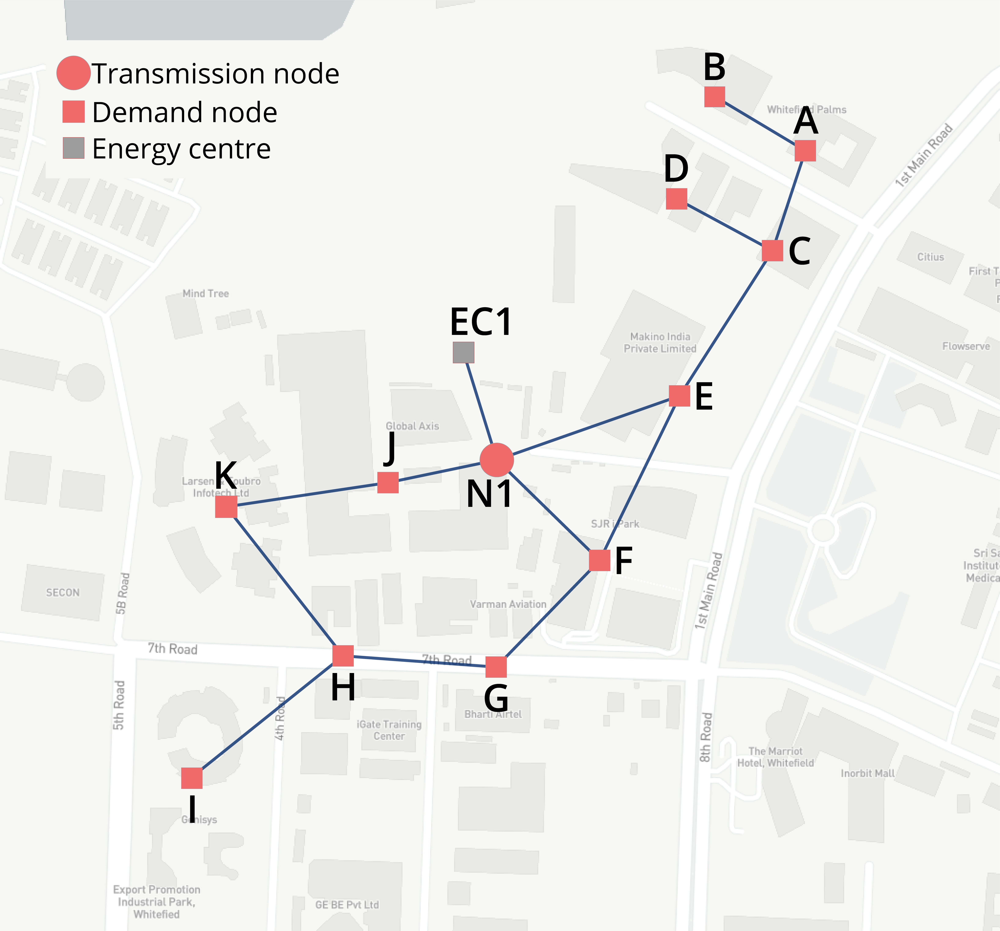

# bangalore-calliope
Calliope model, specific to a (illustrative) district in Bangalore, India.

For more information on the model structure and general use of Calliope, see [the documentation](https://calliope.readthedocs.io/en/stable/).



This commit provides the model for the publication:

`(Under Review) B. Pickering and R. Choudhary, ‘Out-of-Sample, Out of Mind: Quantifying Resilience in Energy Systems with Out-of-Sample Testing’, Energy, 2020`

If you use this model or work derived from it in an academic publication, please cite the above publication!

## Install

This paper ran on a release candidate of Calliope 0.6.3. To install, clone this repository, navigate into the cloned directory and create the 'calliope_DMUU' conda environment:

```shell
$ conda env create -f requirements.yml
```

## Running models

The notebook 'Building and running the model' will guide you through building the model.

## Notes

* Native Calliope plotting will not work in most cases, due to the existence of the 'scenario' dimension.

## Previous model versions

If you're looking for the model used in a previous study, please refer to the commit(s) given in the following link(s):

[`B. Pickering and R. Choudhary, ‘District energy system optimisation under uncertain demand: Handling data-driven stochastic profiles’, Applied Energy, vol. 236, pp. 1138–1157, Feb. 2019. DOI: 10.1016/j.apenergy.2018.12.037`](https://github.com/brynpickering/bangalore-calliope/tree/de561452c8f9bcc97a701ae65bfb4a68d655dd44)

[`B. Pickering, R. Choudhary. Mitigating risk in district-level energy investment decisions by scenario optimisation, In: Proceedings of the 4th IBPSA-England Conference BSO 2018, Emmanuel College, Cambridge, 2018`](https://github.com/brynpickering/bangalore-calliope/tree/fab6bb7f046b335acc36dfbab32954363f5a63db)

## License

[](https://creativecommons.org/licenses/by-sa/4.0/)

This work is licensed under a [Creative Commons Attribution-ShareAlike 4.0 International License](http://creativecommons.org/licenses/by-sa/4.0/).